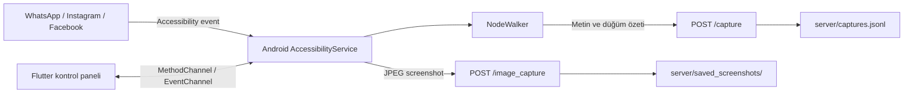

# Android Accessibility Capture

Flutter arayüzü, yerel Android `AccessibilityService` uygulaması ve FastAPI
sunucusundan oluşan bir ekran bağlamı toplama projesidir. Uygulama,
izin verilen Android erişilebilirlik servisi üzerinden belirli uygulamalardaki arayüz ağacını okur, sınırlı bir metin/düğüm özeti çıkarır ve geliştirme bilgisayarında çalışan sunucuya gönderir. Ayrıca belirli aralıklarla ekran görüntüsü alıp JPEG olarak sunucuya yükleyebilir.

> [!WARNING]
> Bu proje ekrandaki metinleri, erişilebilirlik açıklamalarını ve ekran görüntülerini toplayabilir. Yalnızca sahibi olduğunuz cihazlarda, açık kullanıcı bilgisi ve onayıyla kullanın. Mevcut sunucu kimlik doğrulama, TLS, kullanıcı izolasyonu veya üretim ortamı güvenliği sağlamaz.

## Özellikler

- Android erişilebilirlik servisinin durumunu gösteren Flutter kontrol paneli
- Kullanıcıyı doğrudan Android erişilebilirlik ayarlarına yönlendirme
- İzni kaldırmadan veri toplamayı duraklatma ve devam ettirme
- WhatsApp, Instagram ve Facebook için pencere değişikliklerini izleme
- Erişilebilirlik ağacından metin, içerik açıklaması ve düğüm bilgisi çıkarma
- Metin özetlerini JSON olarak FastAPI sunucusuna gönderme
- Ekran görüntülerini JPEG olarak sıkıştırıp sunucuya yükleme
- Yakalanan kayıtları listeleyen ve uygulama bazında özetleyen API uçları
- Hassas çalışma zamanı dosyalarını Git dışında tutan allowlist tabanlı
  `.gitignore`

## Nasıl çalışır?



Android servisi yalnızca aşağıdaki paketleri işler:

| Uygulama | Paket adı |
| --- | --- |
| WhatsApp | `com.whatsapp` |
| Instagram | `com.instagram.android` |
| Facebook | `com.facebook.katana` |

Metin özetleri uygulama başına en fazla 5 saniyede bir, ekran görüntüleri en
fazla 60 saniyede bir gönderilir. Aynı anda yalnızca tek ekran görüntüsü
işlenebilir. Ekran görüntüleri JPEG kalite 80 ile sıkıştırılır.

## Proje yapısı

```text
digital_assistant/
├── lib/
│   ├── main.dart                         # Flutter kontrol paneli
│   └── accessibility_service_manager.dart # Native kanal iletişimi
├── android/app/src/main/
│   ├── AndroidManifest.xml
│   ├── kotlin/.../
│   │   ├── MainActivity.kt               # Flutter/native kanalları
│   │   ├── CaptureAccessibilityService.kt# Olay ve screenshot yönetimi
│   │   └── Util/                          # Node tarama ve ağ katmanı
│   └── res/xml/
│       └── accessibility_capture_service.xml
├── server/
│   ├── main.py                            # FastAPI uygulaması
│   └── requirements.txt                   # Python bağımlılıkları
├── pubspec.yaml
└── README.md
```

`server/captures.jsonl` ve `server/saved_screenshots/` çalışma sırasında
oluşturulur ve hassas veri içerebildikleri için Git tarafından takip edilmez.

## Gereksinimler

- Flutter 3.44 veya uyumlu güncel stable sürüm
- Dart 3.12 veya üzeri
- Android Studio ve Android SDK
- Android 11 / API 30 veya üzeri emülatör ya da fiziksel cihaz
- Python 3.10 veya üzeri
- Hedef uygulamalardan en az biri

Ekran görüntüsü API'si Android 11'de kullanıma sunulduğu için API 30 veya üzeri önerilir. Proje yalnızca Android platformundaki native servisle çalışır; Windows ve web hedeflerinde erişilebilirlik yakalama özelliği bulunmaz.

## Kurulum

### 1. Flutter bağımlılıkları

Proje kök dizininde:

```powershell
flutter doctor -v
flutter pub get
```

`flutter doctor` çıktısında Android toolchain ve kullanılacak cihazın başarılı görünmesi gerekir. Visual Studio uyarıları yalnızca Windows masaüstü hedefini ilgilendirir ve Android çalıştırmasını engellemez.

### 2. Python ortamı ve sunucu bağımlılıkları

Proje kök dizininde:

```powershell
py -m venv .venv
Set-ExecutionPolicy -Scope Process -ExecutionPolicy RemoteSigned
.\.venv\Scripts\Activate.ps1
python -m pip install --upgrade pip
pip install -r server\requirements.txt
```

Sanal ortam daha önce oluşturulduysa yalnızca etkinleştirme ve kurulum
komutlarını çalıştırmak yeterlidir.

## Çalıştırma

Uygulamanın Android emülatöründen erişebilmesi için önce FastAPI sunucusunu
başlatın.

### Terminal 1 — FastAPI sunucusu

```powershell
cd server
..\.venv\Scripts\Activate.ps1
python main.py
```

Sunucu aşağıdaki adreste çalışır:

```text
http://127.0.0.1:8000
```

Sağlık kontrolü:

```powershell
Invoke-RestMethod http://127.0.0.1:8000/health
```

Beklenen durum `status: ok` değeridir.

### Terminal 2 — Flutter uygulaması

Önce cihazı kontrol edin:

```powershell
flutter devices
```

Android emülatörünün kimliği `emulator-5554` ise:

```powershell
flutter run -d emulator-5554
```

İlk açılışta:

1. **Grant Permission in Settings** düğmesine basın.
2. Android erişilebilirlik ayarlarında bu uygulamanın servisini seçin.
3. Servis iznini etkinleştirin ve uygulamaya geri dönün.
4. Panelde `Service is ENABLED` durumunu doğrulayın.
5. Emülatörde WhatsApp, Instagram veya Facebook'u açın.

Başarılı gönderimlerde Flutter terminalinde aşağıdakilere benzer kayıtlar
görünür:

```text
Capture POST response: 200
Screenshot compressed: ... bytes
Success send ss 200
```

## Sunucu adresi

Android kodunda geliştirme sunucusu şu adresle tanımlıdır:

```kotlin
NetworkSyncManager("http://10.0.2.2:8000")
```

`10.0.2.2`, Android Emulator içinden geliştirme bilgisayarının localhost'una
erişmek için kullanılan özel adrestir.

Fiziksel cihaz kullanılırsa bu adres çalışmaz. Cihaz ve bilgisayar aynı ağda
olmalı; adres `http://BILGISAYARIN_YEREL_IP_ADRESI:8000` şeklinde değiştirilmeli ve Windows güvenlik duvarında port 8000'e izin verilmelidir. 

## API uçları

FastAPI otomatik belgeleri sunucu çalışırken şu adreslerde bulunur:

- Swagger UI: `http://127.0.0.1:8000/docs`
- OpenAPI şeması: `http://127.0.0.1:8000/openapi.json`

| Metot | Yol | Açıklama |
| --- | --- | --- |
| `GET` | `/health` | Sunucu sağlık kontrolü |
| `POST` | `/capture` | Metin ve erişilebilirlik düğüm özetini alır |
| `POST` | `/image_capture` | JPEG screenshot alır; `X-User-Id` zorunludur |
| `GET` | `/captures?limit=20` | Son yakalama kayıtlarını listeler |
| `GET` | `/captures/instagram/summary` | Instagram kayıt özetini döndürür |
| `GET` | `/captures/whatsapp/summary` | WhatsApp kayıt özetini döndürür |
| `GET` | `/captures/facebook/summary` | Facebook kayıt özetini döndürür |

Kayıtları PowerShell üzerinden görüntülemek için:

```powershell
Invoke-RestMethod "http://127.0.0.1:8000/captures?limit=5"
Invoke-RestMethod http://127.0.0.1:8000/captures/whatsapp/summary
Invoke-RestMethod http://127.0.0.1:8000/captures/facebook/summary
```

## Toplanan veri

Bir `/capture` kaydı temel olarak şu alanları içerir:

```json
{
  "packageName": "com.whatsapp",
  "appName": "WhatsApp",
  "eventType": "TYPE_WINDOW_CONTENT_CHANGED",
  "capturedAtDevice": "2026-08-16T20:00:00+03:00",
  "screenText": ["..."],
  "nodes": [
    {
      "text": "...",
      "contentDescription": null,
      "className": "android.widget.TextView",
      "viewIdResourceName": null,
      "isClickable": false,
      "isEditable": false
    }
  ]
}
```

Android tarafı bir taramada en fazla 100 düğüm gezer, en fazla 20 benzersiz
metin değeri toplar ve metinleri 120 karakterle sınırlar. Sunucu gelen veriyi
Pydantic modelleriyle doğrular ve yalnızca bilgilendirici düğümleri saklar.

## Duraklatma davranışı

Flutter panelindeki **Pause Service** anahtarı erişilebilirlik iznini kaldırmaz.
Yalnızca servis olaylarının işlenmesini geçici olarak durdurur. Böylece yeniden izin vermeden toplama devam ettirilebilir.


## Bilinen sınırlamalar

- Yalnızca Android desteklenir.
- Hedef uygulama listesi Kotlin kodunda sabittir.
- Screenshot gönderimindeki kullanıcı kimliği şu anda `user_0` olarak sabittir.
- Sunucu geliştirme amaçlıdır; kimlik doğrulama, yetkilendirme ve TLS yoktur.
- HTTP trafiği geliştirme için cleartext olarak açıktır.
- JSONL dosyası büyüklüğü için otomatik temizleme uygulanmamıştır.
- Screenshot dosya kuyruğu yalnızca çalışan sunucu sürecinde tutulur; sunucu
  yeniden başladığında önceki dosyalar kuyruk sayımına alınmaz.
- Erişilebilirlik ağaçları uygulamaya göre eksik veya farklı bilgiler sunabilir.
